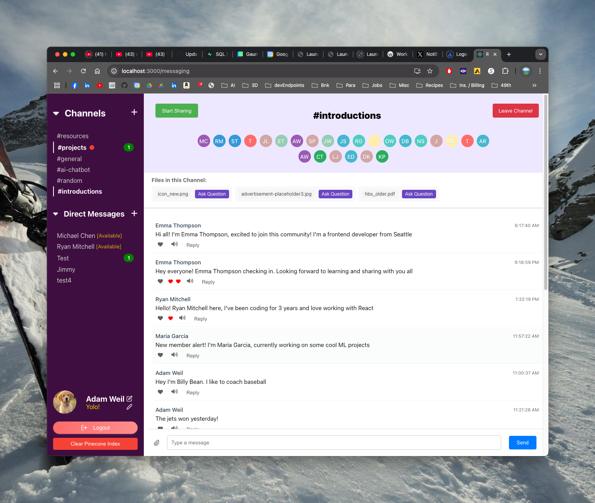

# ChatGenius

ChatGenius is a sophisticated real-time chat application that combines modern messaging capabilities with AI-powered features. Built with React and Firebase, it offers a seamless communication experience with intelligent features like AI assistants and document analysis.

## ✨ Key Features

### 💬 Messaging System
- **Channel-Based Communication**
  - Public channels for team-wide discussions
  - Real-time message updates
  - Message threading and replies
  - File sharing and attachments
  - Message reactions and likes
  - Unread message indicators
  - Message timestamps and read receipts

- **Direct Messaging**
  - Private one-on-one conversations
  - Real-time status updates
  - Online presence indicators
  - Custom user statuses

### 🤖 AI Integration
- **Personal AI Assistant**
  - AI-powered responses that mimic user's communication style
  - Message history analysis for contextual responses
  - Intelligent message indexing using Pinecone vector database
  - Relevance detection for previous conversations

- **Document Analysis**
  - AI-powered document Q&A system
  - Smart document parsing and analysis
  - Context-aware responses based on document content

### 🎥 Media Features
- **Real-time Video**
  - Camera sharing capabilities
  - Stream viewing mode
  - Multi-user video support

- **Voice & Audio**
  - Text-to-speech message playback
  - Voice message support
  - Audio playback controls

### 👤 User Experience
- **Profile Customization**
  - Custom user avatars
  - Status messages
  - Profile editing
  - User preferences

- **Interface**
  - Modern, responsive design
  - Dark/light mode support
  - Intuitive navigation
  - File preview system

## 🚀 Getting Started

### Prerequisites
- Node.js (v14 or higher)
- npm or yarn
- Firebase account
- OpenAI API key
- Pinecone API key
- ElevenLabs API key (for voice features)

### Installation

1. Clone the repository
2. Install dependencies
3. Configure environment variables
    Create a `.env` file in the root directory:
        REACT_APP_FIREBASE_API_KEY=your_firebase_api_key
        REACT_APP_FIREBASE_AUTH_DOMAIN=your_auth_domain
        REACT_APP_FIREBASE_PROJECT_ID=your_project_id
        REACT_APP_FIREBASE_STORAGE_BUCKET=your_storage_bucket
        REACT_APP_FIREBASE_MESSAGING_SENDER_ID=your_sender_id
        REACT_APP_FIREBASE_APP_ID=your_app_id
        REACT_APP_OPENAI_API_KEY=your_openai_api_key
        REACT_APP_PINECONE_API_KEY=your_pinecone_api_key
        REACT_APP_ELEVEN_LABS_API_KEY=your_eleven_labs_api_key
4. Start the development server
    npm start

## 🛠️ Technology Stack

### Frontend
- React.js
- React Router DOM
- FontAwesome Icons
- date-fns
- React Modal
- React Draggable
- React Tooltip

### Backend & Services
- Firebase
  - Authentication
  - Firestore Database
  - Cloud Storage
  - Hosting
- OpenAI API
- Pinecone Vector Database
- ElevenLabs Text-to-Speech

### Development Tools
- Create React App
- ESLint
- Babel
- Webpack

## 📱 Available Scripts

- `npm start` - Run development server
- `npm build` - Build for production
- `npm test` - Run tests
- `npm run eject` - Eject from Create React App
- `npm run reset-db` - Reset database
- `npm run seed-db` - Seed database with initial data

## 🔒 Security Features

- Secure authentication system
- Protected routes
- File upload restrictions
- Environment variable protection
- Firebase security rules

## 🤝 Contributing

Contributions are welcome! Please feel free to submit a Pull Request. For major changes, please open an issue first to discuss what you would like to change.

## 📄 License

This project is licensed under the MIT License - see the [LICENSE](LICENSE) file for details.

## 👏 Acknowledgments

- OpenAI for AI capabilities
- Firebase team for the real-time database and hosting
- ElevenLabs for text-to-speech functionality
- All contributors who have helped shape this project
